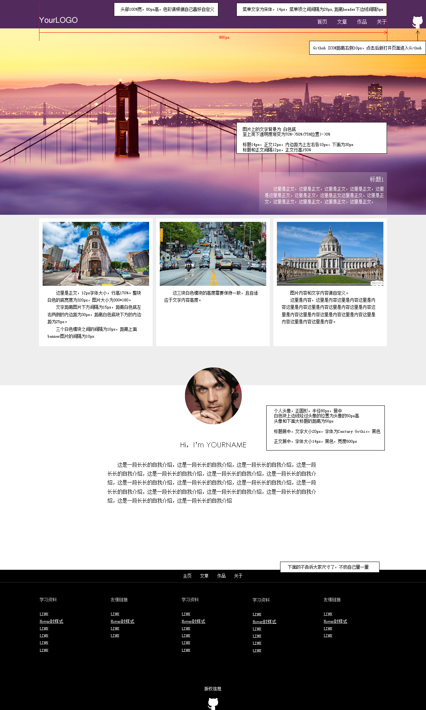
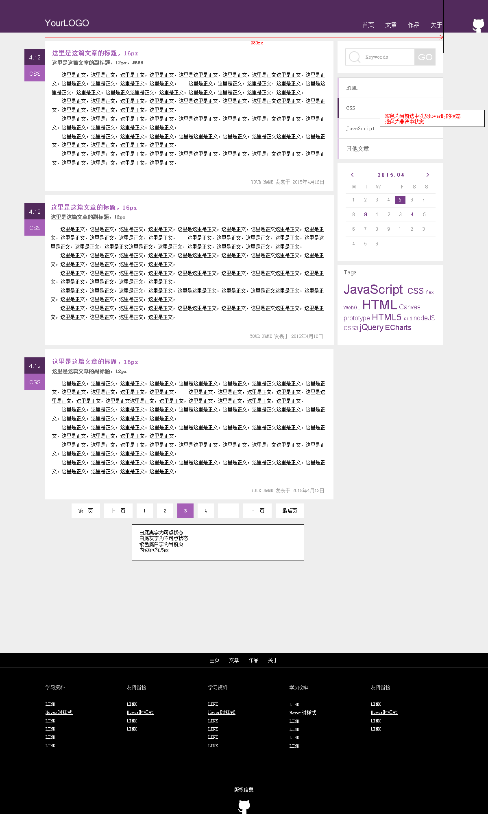
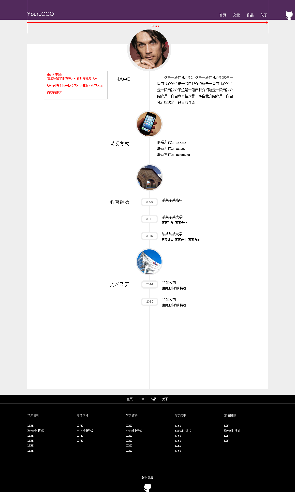
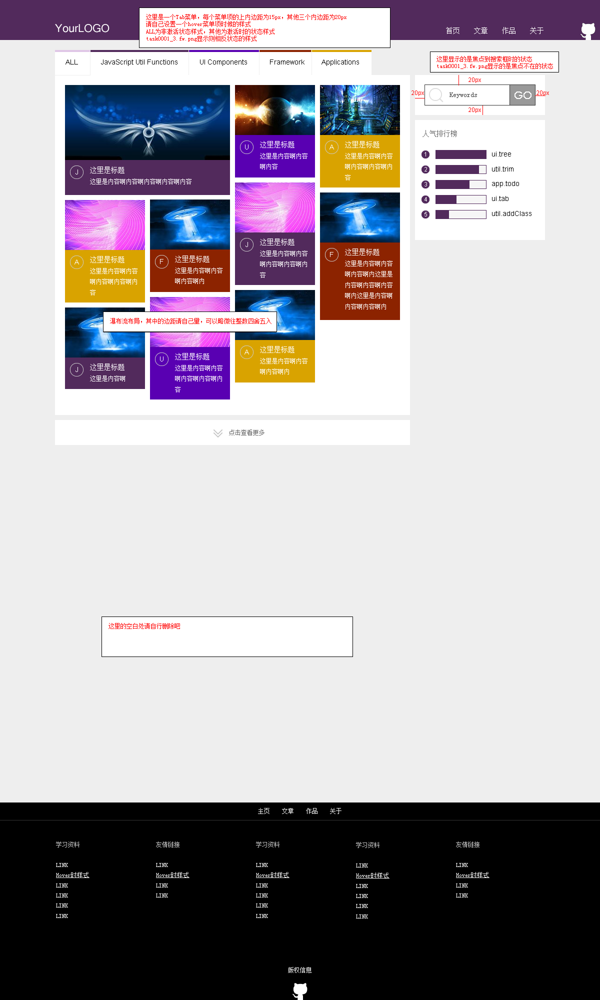

# ghost-team-task01

###团队成员
+ 我是小鬼
+ 小白
+ dmax
+ 茶色
+ PT

###Github团队协作
资料：   
[使用GitHub进行团队合作](http://book.haoduoshipin.com/gitbeijing/github_flow.html)   
[连猴子都能懂的Git入门指南](https://backlogtool.com/git-guide/tw/intro/intro1_1.html)

###团队协作的第一次任务

希望我们一起通过Github平台完成IFE于2015年春季布置的任务一中的第7个小任务，根据提供的设计稿完成HTML文档。
链接如下：

[https://github.com/baidu-ife/ife/tree/master/2015_spring/task/task0001](https://github.com/baidu-ife/ife/tree/master/2015_spring/task/task0001)

###任务认领（请想要完成某个页面的伙伴们将自己的名字写在下面对应的每个页面的后面）

**说明：**设计稿在所建项目的**img**文件夹里面，页面编写在**html**文件夹里面，样式文件请在**css**文件夹里面新建或者全部都写在style.css文件中。

* **首页（index.html）小白**，设计稿如下图：

* **博客列表页（blog.html）**，设计稿如下图：

* **自我简介页（about.html）**，设计稿如下图：

* **图墙页面（gallery.html）**，设计稿如下图：
